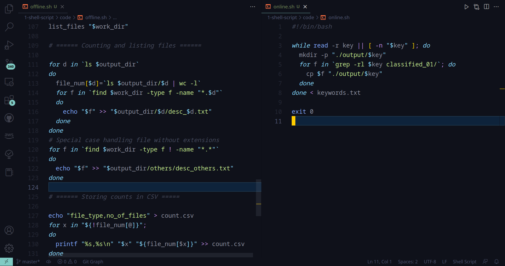
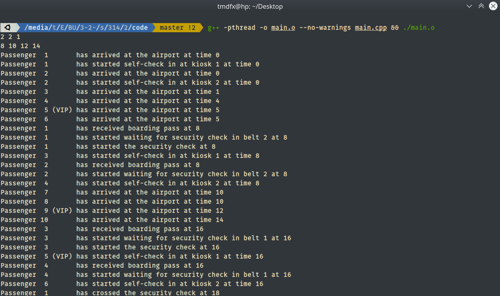
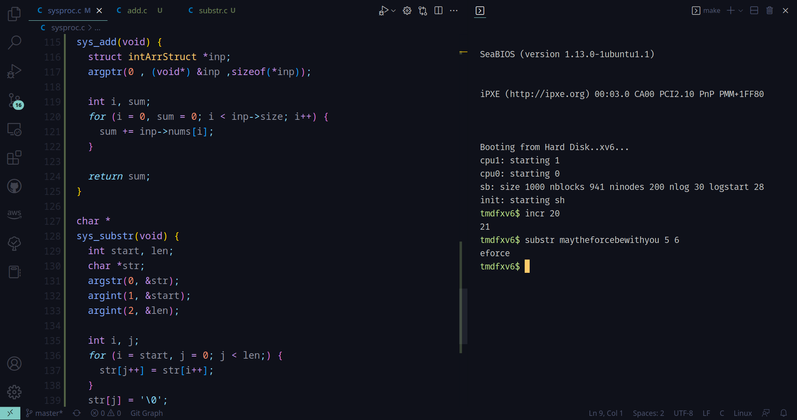
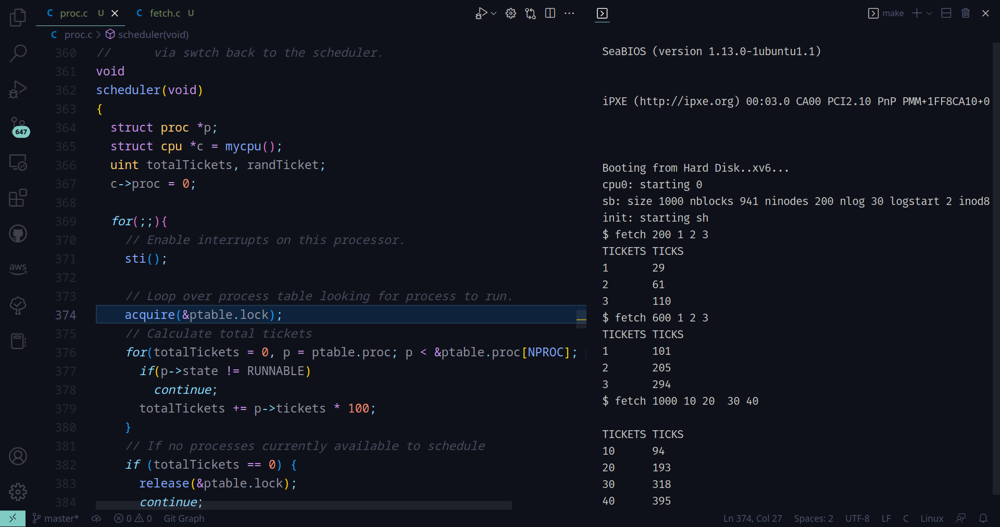
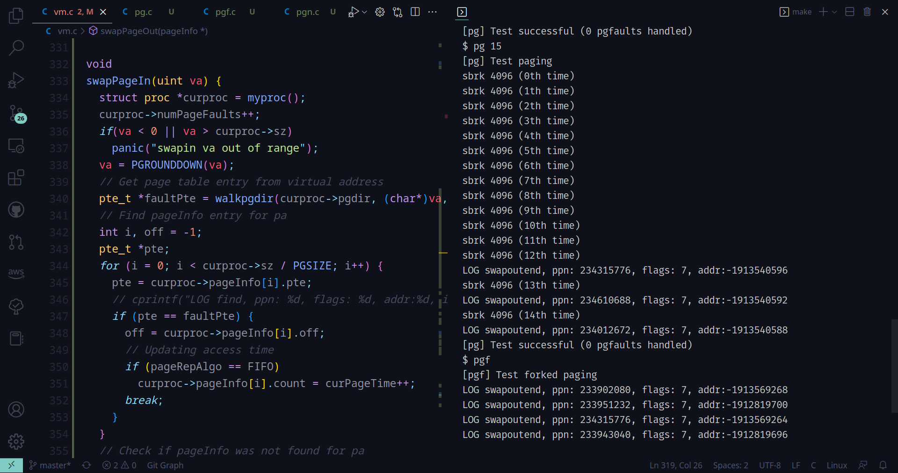

# Operating Systems

This repository is a collection of some of my works with operating systems in the course CSE-314. The course initially covered the basics of shell scripting (`bash`) and then inter process communication (POSIX threads / `pthread`). After that we worked on `xv6` ([website](https://pdos.csail.mit.edu/6.828/2022/xv6.html), [wiki](https://en.wikipedia.org/wiki/Xv6), [github](https://github.com/mit-pdos/xv6-public)) which is a reimplementation of [Unix v6](https://en.wikipedia.org/wiki/Version_6_Unix) by MIT for modern x86-based multiprocessor using ANSI C. We primarily worked on creating system calls, modifying the scheduling algorithm and finally developing a complete paging framework for memory management. `qemu` ([website](https://www.qemu.org/)) was used as an emulator to run the operating system. 

## Offline 1: Shell Script



**Instructions**: 
- Offline - [[PDF]](/1-shell-script/instructions-offline.pdf)
- Online - [[PDF]](/1-shell-script/instructions-online.pdf)

**Implementation**
- Offline - [[Code]](/1-shell-script/code/offline.sh)
- Online - [[Code]](/1-shell-script/code/online.sh) 

**Run**
```bash
chmod +x ./offline.sh
./offline.sh
```

## Offline 2: Interprocess Communication (`pthread`)



**Instructions**: [[PDF]](/2-pthread-ipc/instructions.pdf)

**Implementation**: Passenger onboarding system [[Code]](/2-pthread-ipc/code)

**Run**:
```bash
g++ -pthread -o main.o --no-warnings main.cpp
./main.o
```

## Offline 3: System calls (`xv6`)



**Instructions**: Practice creating system calls and user programs

**Implementation**:
- Modified xv6 repo - [[Code]](/3-xv6-system-call/code)
- Practice 1 patch file - [[Code]](/3-xv6-system-call/practice-1.patch)
- Practice 2 patch file - [[Code]](/3-xv6-system-call/practice-2.patch)

**Run**:
```bash
# Run this in the xv6 repo
# Requires qemu installed 
make qemu-nox
```

## Offline 4: Scheduling processes (`xv6`)



**Instructions**: Lottery process scheduling [[PDF]](/4-xv6-scheduling/instructions.pdf)

**Implementation**:
- Modified xv6 repo - [[Code]](/4-xv6-scheduling/code)
- Modification patch file - [[Code]](/4-xv6-scheduling/1705039.patch)
- Testing patch file - [[Code]](/4-xv6-scheduling/1705039_test.patch), [[Source]](https://www.cs.virginia.edu/~cr4bd/4414/S2021/lottery.html)

**Run**:
```bash
# Run this in the xv6 repo
# Requires qemu installed 
make qemu-nox
```

## Offline 5: Memory management (`xv6`)



**Instructions**: Paging framework (FIFO, NFU) [[PDF]](/5-xv6-memory-management/instructions.pdf)

**Implementation**:
- Modified xv6 repo - [[Code]](/5-xv6-memory-management/code)
- Modification patch file - [[Code]](/5-xv6-memory-management/1705039.patch)
- Original patch file (given) - [[Code]](/5-xv6-memory-management/paging.patch)

**Run**:
```bash
# Run this in the xv6 repo
# Requires qemu installed 
make qemu-nox
```
